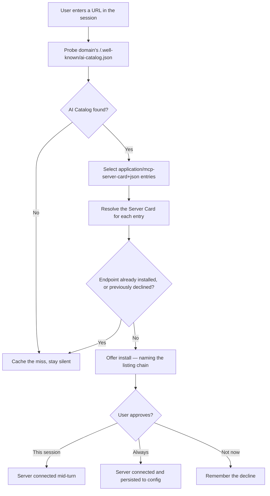
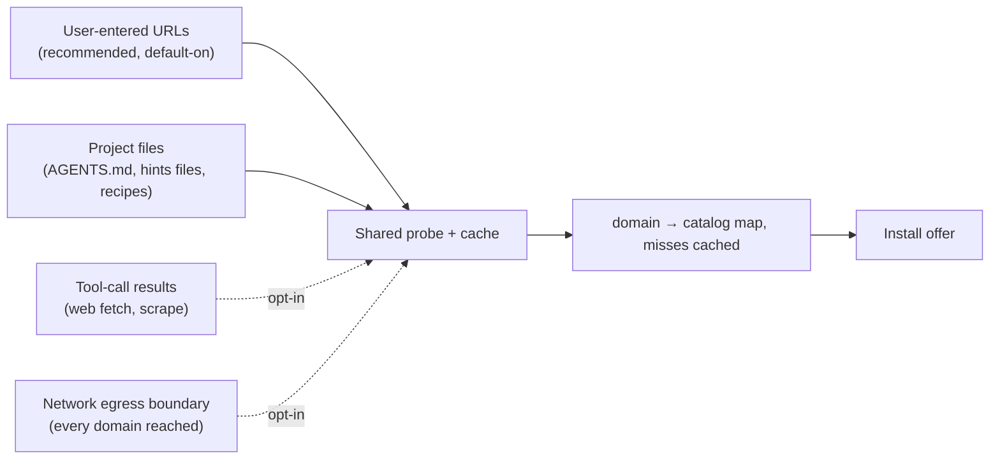

# MCP Server Card Best Practices

Practical guidance for the two sides of the Server Card ecosystem: people **hosting**
remote MCP servers, and people **building MCP clients** that discover and connect to them.

This document is advisory. The normative mechanics for Server Cards live in the
[README](../README.md) and [discovery.md](./discovery.md), and the catalog format is defined
by the [AI Catalog specification](https://ai-catalog.io/spec/) — this page only
collects recommendations on top of them.

## Best Practices for Server Implementors

If you host a remote MCP server, we highly recommend you serve a Server Card — and publish an
AI Catalog entry that points at it. The two do different jobs: the card is how a client
_connects_ to you, and the catalog is how a client _finds_ you in the first place. The guidance
below covers what to put in the card, what does not belong in one, and where to publish the
catalog entry.

### Serve a card: it is your connection entry point

A Server Card advertises how to connect — transport endpoints, supported protocol versions, and
a hint at the incoming requirements a client should expect (such as authentication) — before
the client connects, and without prior configuration. This is valuable on its own, with no
catalog involved: a client that already knows your MCP URL can point at the card directly.

Keep in mind the card is advisory and read before connecting, so clients reconcile it against
the live connection and
[MUST NOT treat it as authoritative for access control](./discovery.md#consistency-with-runtime-behavior) —
the connection itself remains the source of truth.

### Fill out your card completely

Populate every applicable field — not just the required minimum. `description` is required, but
the optional identity fields (`title`, `icons`, `repository`, `websiteUrl`) and fully-specified
transport metadata are what make your server easy to discover, present, and connect to.

### Server Cards describe remote connectivity only

If your server is **not remote**, there is nothing to serve a card for — Server Cards exist to
advertise remote transport endpoints only. Locally-installable server metadata lives in the
[MCP Registry](https://github.com/modelcontextprotocol/registry)'s `server.json` schema instead
(see [Relationship to the MCP Registry](../README.md#relationship-to-the-mcp-registry)).

Internal-only but still remote is a different case: serve a card anyway. Even if your server is
not meant for the public, a card is still worth publishing — some clients may discover and
connect to you this way within your organization.

### Link your card from an AI Catalog entry

A card lets a client connect once it has your URL; an
[AI Catalog](https://ai-catalog.io/spec/) is what lets clients find that URL in the first place —
so publish both. An AI Catalog is a cross-protocol discovery document that can index your MCP
server alongside other AI artifacts; see [discovery.md](./discovery.md).

**Serve it at `/.well-known/ai-catalog.json`.** That is the one location a client can try
against a bare domain, with nothing fetched from you first — which is exactly what in-session
discovery depends on. (The specification allows a catalog to live elsewhere, and defines other
ways to point at one; support for those is tracked in
[#43](https://github.com/modelcontextprotocol/experimental-ext-server-card/issues/43).)

Publish it at the domain people associate with your service:

- For a **public server**, that is your **primary domain** — the domain humans or agents would
  naturally associate with your service.
- For an **internal enterprise** server, that is wherever an internal team would first encounter
  you — for example the domain hosting your REST API or the other resources a team becomes aware
  of _before_ they learn you also expose MCP.

Review the guidance below for Client Implementors to determine the appropriate domain for your service. For example, for GitHub, it would be common for the user of a coding agent to paste a URL like `https://github.com/modelcontextprotocol/experimental-ext-server-card/pull/36` into a session. So `github.com/.well-known/ai-catalog.json` is an excellent place to put your AI catalog - not `api.githubcopilot.com/.well-known/ai-catalog.json`, where GitHub's MCP server [happens to live](https://github.com/github/github-mcp-server).

## Best Practices for Client Implementors

Every MCP server your client can discover organically helps the user to stay in the flow while giving them the capabilities they need. The hard part is that connecting a server is often a chore where the user has to leave their flow to configure it out of band, before it can help them — so most users never do it.

As per above guidance for server implementors, we now have a way for them to advertise
their service in an easy-to-find, standardized location. Using this, your client can offer the
connection **at the moment the user is already referencing that service** — mid-session, in
context, instead of in a settings pane the user never visits.

If you wire that in where we recommend below, it costs you remarkably little:

- **No new UX to design.** You already ask users to approve consequential actions like tool calls. This is one
  more approval, in a flow they already know.
- **No new trust to establish.** You only ever offer servers published by a domain the user
  themselves just put in front of you. You are not recommending anyone — the domain the user
  named is.
- **No discovery problem to solve.** No ranking, no index, no crawl, no editorial judgment.
  The user supplied the domain; you are just asking it what it offers.

The outcome compounds in every direction: the user gets a capability exactly when they need
it, your client gets stickier, the service gets reached by agents that would otherwise have
scraped it or given up, and the pie grows as complementary AI services get strung together.

### Where to trigger discovery

The probe itself is cheap: one asynchronous `GET /.well-known/ai-catalog.json`, run in the
background so it never blocks what the user asked for. Build that one first — it is the probe
you can run against a bare domain, without having fetched anything from it. Additional ways to
locate a catalog are tracked in
[#43](https://github.com/modelcontextprotocol/experimental-ext-server-card/issues/43); expect
this list to grow, and keep the resolution step separate from the triggers below so it can.

The design decision, then, is not _how_ to probe — it is **which moments** in a session should
trigger one.

Where a concrete example helps, this section points at [Goose](https://goose-docs.ai/), an
open-source MCP agent hosted by the Agentic AI Foundation, simply because its hooks and install
path are easy to read. Nothing
here is Goose-specific — every mechanism below has an equivalent in any client that runs tools,
reads project files, or mediates network access.

#### Start here: probe the domains a user hands you

**At minimum, we recommend a default-on experience that probes any domain a user enters as a
URL.** This is the strongest signal in the session and the safest place to begin: the user
typed or pasted the domain themselves, so there is no ambiguity about intent, no inference,
and no domain touched that the user did not already name.



One detail worth getting right when you walk the entries: an entry carries its artifact either
by reference or inline, so not every entry requires a fetch. Catalogs can also be organized in
ways this extension does not yet resolve — see
[#44](https://github.com/modelcontextprotocol/experimental-ext-server-card/issues/44) — so treat
"read the entries" as a step that will gain cases, not a fixed one.

A closely related and equally bounded set: the domains a **project** already points at — links
in an `AGENTS.md`, a project config, or whatever hints file your client injects into the system
prompt (in Goose, `.goosehints`, which supports literal `https://` URLs). Probe that set once at
session start rather than on every turn. These are domains the project is built around, the user
put them there deliberately, and there are only ever a handful.

#### Expand carefully: broader triggers, off by default for now

Beyond user-supplied URLs, the same probe can hang off progressively broader signals. These
find more servers and touch more domains, and the trade is the same each time: **broader
coverage, at the cost of more requests, more noise, and more domains learning the user
interacted with them.**



- **Tool-call results.** The user or the agent chose to retrieve a page, which is close to
  direct intent. If your client can intercept tool calls, select the URL-bearing ones — a web
  fetch or scrape — and read the target host out of the tool's input before or alongside the
  call. This needs no change to the tool itself, and you stay in control of _which_ tools
  trigger a probe. (Goose implements this shape with
  [lifecycle hooks](https://goose-docs.ai/docs/guides/context-engineering/hooks), following the
  cross-tool [Open Plugins](https://open-plugins.com/agent-builders/components/hooks) spec: a
  plugin's `hooks/hooks.json` maps `PreToolUse` / `PostToolUse` to scripts, with a `matcher`
  regex selecting the tool and the tool input handed to the hook as JSON. Note the hook layer
  runs local commands, so it is itself a surface worth trusting deliberately.)
- **The network egress boundary.** The broadest option: if your client already mediates network
  access, that chokepoint sees every domain the agent actually reaches, not just the ones a tool
  or file surfaced — so discovery can ride the same seam as the filtering you already do there.
  It composes with an allow/deny boundary you may already run, but it is also where the noise is
  worst: most domains publish no catalog, so the caching in
  [Keep probing cheap](#keep-probing-cheap-and-let-enterprises-scope-it) matters most here. (A
  sandbox that denies the agent direct network access and tunnels its traffic through a local
  proxy already has this chokepoint; the proxy sees every destination before the connection is
  made.)

**We do not recommend turning these on by default at this time.** Ship them opt-in, behind a
setting, while the ecosystem and the interaction pattern are still young — the default-on
case above is the one where the user's intent is unambiguous, and it is worth learning how
that experience lands before widening the aperture. As implementations gather evidence, this
guidance may change.

### Turn a hit into a one-click install

You almost certainly do not need new machinery for this. Your client already has a way to add
an MCP server — a config file, an install command, a deep link from an extensions directory —
and a Server Card carries exactly what that path needs: the endpoint, the transport, and the
identity to display. Discovery just supplies those values from a catalog instead of from a user
who typed them.

So when a probe finds an entry, surface it (interrupting the turn or presenting it passively is
your call) and route the accept into the install path you already have. The one thing worth
insisting on is that the server is added and connected **mid-turn** — the value here is the
user not having to leave what they were doing.

For a concrete instance: in Goose an extension _is_ an MCP server, so a card maps onto its
existing [install path](https://goose-docs.ai/docs/getting-started/using-extensions) directly —
either the `goose://extension?...` deep link its extensions directory generates, or the
equivalent block written into `config.yaml`.

### Security and trust considerations

#### Show the listing chain, not just the endpoint

The domain that publishes a catalog is often **not** the domain that hosts the server it points
at — a catalog on `example.com` may list a server running on `mcp-host-saas.com`. A prompt that
names only the endpoint asks the user to trust a domain they may not recognize as belonging to
the service, which is indistinguishable, from the user's side, from a phishing prompt.

Surface the **chain** instead: the domain the user actually interacted with, the fact that it
listed the entry, and the domain that will own the connection. Name both, and make it clear
which one the credentials and traffic will go to.

A minimal prompt carrying that chain:

```
┌──────────────────────────────────────────────────────────┐
│  Connect an MCP server?                                  │
│                                                          │
│  example.com lists a server it does not host:            │
│                                                          │
│      Example          example.com                        │
│         └── hosted at  mcp-host-saas.com                 │
│                                                          │
│  Requests and any credentials you approve will go to     │
│  mcp-host-saas.com.                                      │
│                                                          │
│         [ Not now ]   [ This session ]   [ Always ]      │
└──────────────────────────────────────────────────────────┘
```

Two things are doing the work here. The listing domain is the one the user recognizes and just
interacted with, so it leads. The hosting domain is named as a **consequence** — where traffic
and credentials actually go — rather than as a bare URL the user is asked to pattern-match
against a brand they know.

Be careful what you claim for that chain. A listing is an assertion by whoever controls the
domain, not a verified statement about the server: the AI Catalog specification attaches no
endorsement semantics to publication, and a compromised catalog host can inject entries. Where
an entry carries a
[trust manifest](https://ai-catalog.io/spec/#trust-manifest),
that — publisher identity and attestations — is the mechanism built for this decision, and the
listing chain is what you fall back on when it is absent.

#### Do not let a probe reach where a user could not

A probe is an outbound request to a host the client picked, which makes it a request-forgery
primitive if you leave it unbounded. Restrict it to publicly resolvable hosts: reject IP
literals, loopback, link-local, and private ranges, and re-check after DNS resolution rather
than only on the hostname, so a name that resolves inward is caught. `169.254.169.254` and its
equivalents are the case that matters most — a cloud instance probing its own metadata endpoint
is a credential disclosure, not a discovery miss.

The rest is ordinary hygiene, and worth stating because the probe is automatic and unattended:
send no cookies, credentials, or ambient authorization; cap the response size and the number of
entries you will follow; and bound redirects, resolving each hop under the same rules — a
redirect is the easy way around a check applied only to the URL you started with. In a managed
environment, an internal host that _does_ serve a catalog is best reached through the enterprise
controls below rather than by relaxing these rules.

#### Always ask before installing — and be stricter here than you are with tools

Reuse the consent surface your users already know; do not invent a second vocabulary for
discovery. But hold discovery to a **higher bar than tool calls**. Approving a tool call
authorizes one action by code the user already chose to run. Installing a discovered server
adds a new, unvetted counterparty to the session — one that will expose its own tools, receive
its own inputs, and persist if the user lets it. That asymmetry means the autonomy settings a
client offers for tools should not simply extend to installs:

- **A discovered server should never be installed automatically.** No "completely autonomous"
  mode should silently connect one. The approval dialog is load-bearing: the listing chain is
  the user's main signal, and skipping the prompt discards it.
- **There is no blanket "always allow."** An install approval is scoped to _that server_, never
  to discovery in general and never to a domain's future entries.

Offer the user two accept paths, which is the distinction the prompt above encodes:

- **This session** — connect now, discard at session end. The right default for a server the
  user is trying out; a mistake costs one session.
- **Always** — persist the server to the user's configuration, as if they had installed it
  themselves. This is the equivalent of _always allow_, scoped to that one server.

Together with **Not now**, that is the whole vocabulary. A user who wants a server permanently
can say so in one click, and a user who is merely curious is not talked into a permanent
change to their setup.

#### De-duplicate, and let the user turn it off

Discovery is only useful if it stays quiet. A client that re-offers a server the user already
runs, or that surfaces every entry on a busy catalog at once, trains the user to dismiss the
prompt without reading it — which costs you the one moment where the listing chain above
actually gets evaluated.

- **Track what is already installed, keyed on the server's endpoint.** Match a discovered entry
  against the user's configured servers on the transport URLs in the card's `remotes[]` — the
  thing you would actually connect to. Resist keying on the card's `name` or the entry's
  `identifier`: both are strings the catalog asserts about itself, so a hostile entry that
  claims a name you already run would silence the prompt by design. Endpoint matching has no
  such failure mode, since an entry that names the same endpoint _is_ the same server. Note this
  means the de-dup check happens after you fetch the card, not before.
- **Consider culling a long catalog.** A domain may list many servers. Presenting the full list
  is usually fine — most catalogs are short. But if a catalog is long, there is room to get
  creative: an inference step over the entries' descriptions, weighed against what the user is
  actually doing in the session, can surface the two or three that fit and tuck the rest behind
  a "show all." This is an open design space, and we would like to see what clients try.
- **Remember a "no."** Give the user a durable _don't ask me again_ — per server, and per
  domain — and honor it across sessions. A declined install is a preference, not a
  per-turn answer.

#### Keep probing cheap, and let enterprises scope it

Run probes asynchronously and never block the operation the user asked for. Cache the result
per domain — _including misses_, since most domains publish no catalog — and honor the
catalog's `Cache-Control` response headers so you do not re-probe on every touch. When a cached
entry does expire, revalidate rather than refetch: store the `ETag` a catalog or card endpoint
returns and send it back as `If-None-Match`, so an unchanged document costs you a `304` and no
body.

Because each probe reveals to the domain that the user interacted with it, give enterprises
control: an organization might disable in-session discovery entirely, or restrict it to an
allowlist of domains.

Outright disabling is the blunt option, and it throws away the signal. In a managed
environment, the interesting move is to **keep discovering and change what a hit does**. An
employee who hits a useful server is exactly the demand signal a platform team wants, and today
that signal is lost — the user shrugs, works around it, and nobody learns the server was
wanted. Instead of offering a direct install, route the find into the organization's existing
approval path: the client swaps the install button for a request, pre-filled from the catalog
entry and Server Card it already fetched, so the user supplies intent and the client supplies
the technical detail.

```
┌──────────────────────────────────────────────────────────┐
│  Request this server from IT                             │
│                                                          │
│  Direct installs are disabled by your organization.      │
│                                                          │
│  Server     Example                                      │
│  Listed by  example.com                                  │
│  Hosted at  mcp-host-saas.com                            │
│  Transport  streamable HTTP                              │
│                                                          │
│  Why do you need it?                                     │
│  ┌────────────────────────────────────────────────────┐  │
│  │ Reviewing tickets in the session — would let the   │  │
│  │ agent read them directly instead of pasting them.  │  │
│  └────────────────────────────────────────────────────┘  │
│                                                          │
│              [ Cancel ]        [ Send request ]          │
└──────────────────────────────────────────────────────────┘
```

Where that request lands is the organization's business — a ticket, a Slack approval, a pull
request against a gateway's server list. What matters for a client implementor is that the
Server Card gives you most of what the approver needs (identity, endpoint, transport, protocol
versions) without the user having to hunt for it, and that an approved request ends with the
server added to the **managed gateway** the whole org already connects through, rather than
installed ad hoc on one laptop. The user gets a path instead of a dead end, and the platform
team gets a queue of real, evidenced demand.
