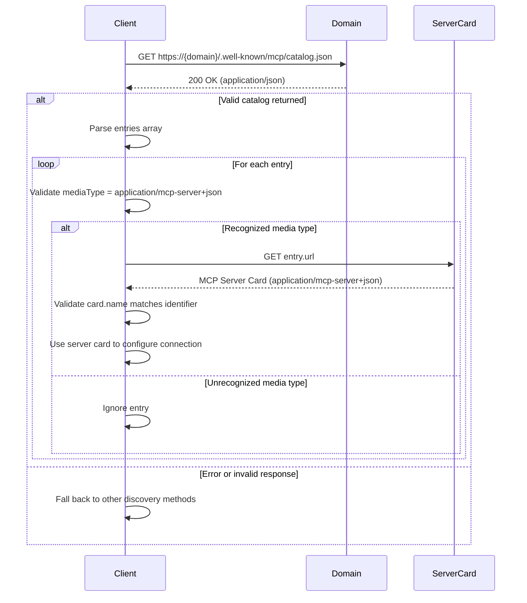

# MCP Catalog Discovery Specification

**Status:** Draft

## Overview

An **MCP Catalog** is a JSON document published by an organization to advertise the [MCP Server Cards](#mcp-server-card) relevant to its services, enabling config-free auto-discovery by MCP clients. It is a minimal, MCP-scoped subset of the [AI Catalog](https://github.com/Agent-Card/ai-catalog) specification.

The catalog MAY reference servers operated on web hosts different from the one serving the catalog itself — for example, `acme.org/.well-known/mcp/catalog.json` MAY advertise servers operated by `mcp-server-host-saas.com` on Acme's behalf. The catalog represents the organization's curated set of advertised servers, regardless of which web host actually serves them.

> **Note on terminology:** Throughout this spec, "MCP server" refers to a Model Context Protocol server (the MCP-client sense). When this document needs to refer to the operator of a web endpoint or the machine serving HTTP requests, it uses "web host" or "operator" instead, to avoid ambiguity.

## Publishing Recommendation

Organizations offering services accessible via MCP SHOULD publish an MCP Catalog at the domain users associate with the service. The MCP Catalog SHOULD live at:

```
/.well-known/mcp/catalog.json
```

## Well-Known URI

```
/.well-known/mcp/catalog.json
```

The catalog endpoint:

- MUST be accessible via HTTPS (HTTP MAY be supported for local/development use)
- MUST return `Content-Type: application/json`
- MUST include appropriate CORS headers (see [Security Considerations](#security-considerations))
- SHOULD include appropriate caching headers (see [Security Considerations](#security-considerations))

## Catalog Format

The catalog is a JSON object with the following top-level members:

| Field         | Type   | Required | Description                                                                         |
| ------------- | ------ | -------- | ----------------------------------------------------------------------------------- |
| `specVersion` | string | No       | Version of the MCP Catalog format. Currently `"draft"` when present. See note below. |
| `entries`     | array  | Yes      | Array of [Catalog Entry](#catalog-entry) objects. MAY be empty.                     |

> **Note on `specVersion`:** The upstream [AI Catalog](https://github.com/Agent-Card/ai-catalog) currently requires `specVersion`. This spec deliberately makes it OPTIONAL so that a minimal catalog can simply be `{"entries": [...]}`. We intend to push the AI Catalog to align by making `specVersion` optional there as well.

## Catalog Entry

Each entry in the `entries` array is a JSON object with exactly three required fields:

| Field        | Type   | Required | Description                                                                  |
| ------------ | ------ | -------- | ---------------------------------------------------------------------------- |
| `identifier` | string | Yes      | A URN identifying this server. See [Identifier](#identifier) below.          |
| `mediaType`  | string | Yes      | MUST be `application/mcp-server+json`. See [MCP Server Card](#mcp-server-card). |
| `url`        | string | Yes      | URL where the full [MCP Server Card](#mcp-server-card) can be retrieved.     |

All metadata (name, description, capabilities, etc.) lives in the [MCP Server Card](#mcp-server-card) itself — the catalog entry intentionally carries no optional fields.

### Identifier

The `identifier` field MUST begin with the prefix `urn:mcp:server:`. The portion of the identifier after this prefix MUST exactly match the `name` value of the referenced [MCP Server Card](#mcp-server-card) (i.e., the `name` field in the server's `server.json`).

Server `name` values SHOULD use reverse-DNS notation to ensure global uniqueness (e.g., `com.example/weather`). The full identifier then takes the form:

```
urn:mcp:server:<reverse-dns-name>
```

For example, a server whose `server.json` declares `"name": "com.example/weather"` MUST be referenced as `urn:mcp:server:com.example/weather`.

## MCP Server Card

An **MCP Server Card** is a JSON document describing a single MCP server: its name, capabilities, transport, authentication requirements, and other metadata needed for a client to connect. The detailed schema for MCP Server Cards is defined by [SEP-2127](https://github.com/modelcontextprotocol/modelcontextprotocol/pull/2127); the rest of this section captures only what the MCP Catalog spec needs.

### Media Type

MCP Server Cards are identified by the media type:

```
application/mcp-server+json
```

A web host serving an MCP Server Card:

- MUST return `Content-Type: application/mcp-server+json`
- MUST include a `name` field whose value globally identifies the server (the same value referenced by the catalog's `identifier`, minus the `urn:mcp:server:` prefix — see [Identifier](#identifier))

Clients fetching a URL from a catalog entry SHOULD validate that the returned `Content-Type` is `application/mcp-server+json` and that the document's `name` matches the catalog entry's `identifier`.

## Examples

### Single Server

```json
{
  "entries": [
    {
      "identifier": "urn:mcp:server:com.example/weather",
      "mediaType": "application/mcp-server+json",
      "url": "https://example.com/.well-known/mcp-server-card"
    }
  ]
}
```

### Multiple Servers

```json
{
  "specVersion": "draft",
  "entries": [
    {
      "identifier": "urn:mcp:server:com.acme/code-review",
      "mediaType": "application/mcp-server+json",
      "url": "https://acme.com/.well-known/mcp-server-card/code-review"
    },
    {
      "identifier": "urn:mcp:server:com.acme/docs-search",
      "mediaType": "application/mcp-server+json",
      "url": "https://acme.com/.well-known/mcp-server-card/docs-search"
    },
    {
      "identifier": "urn:mcp:server:com.acme/ci-cd",
      "mediaType": "application/mcp-server+json",
      "url": "https://acme.com/.well-known/mcp-server-card/ci-cd"
    }
  ]
}
```

### Cross-Host Advertising

An organization MAY advertise servers operated by a third party on its behalf:

```json
{
  "entries": [
    {
      "identifier": "urn:mcp:server:org.acme/support",
      "mediaType": "application/mcp-server+json",
      "url": "https://mcp-server-host-saas.com/acme/support/.well-known/mcp-server-card"
    }
  ]
}
```

Here, `acme.org/.well-known/mcp/catalog.json` advertises a server whose card is served by `mcp-server-host-saas.com`. The `identifier` remains scoped to Acme because Acme is the organization advertising the server.

## Client Discovery Flow



Clients SHOULD validate that each entry has `mediaType` set to `application/mcp-server+json` and MUST ignore entries with unrecognized media types. This ensures forward compatibility as new entry types are introduced.

## Relationship to AI Catalog

The MCP Catalog is a transitional mechanism designed to provide immediate value while the broader [AI Catalog](https://github.com/Agent-Card/ai-catalog) specification matures.

- **Structural compatibility:** MCP Catalog entries are structurally compatible with AI Catalog entries. Each entry uses the same `identifier`, `mediaType`, and `url` fields.
- **Dual serving:** Organizations MAY serve both `/.well-known/mcp/catalog.json` and the AI Catalog well-known URI during the transition period. The same entries can be used in both documents.
- **Direct inclusion:** MCP Catalog entries can be included directly in an AI Catalog document without modification. No field mapping or transformation is required.

As the AI Catalog specification stabilizes, implementers SHOULD plan for eventual migration to the unified catalog format.

## Security Considerations

### Information Disclosure

Catalog entries MUST NOT include sensitive information. The catalog is a public discovery document — all fields are intended to be world-readable.

### CORS Requirements

The catalog endpoint MUST include the following CORS headers to enable browser-based clients:

```
Access-Control-Allow-Origin: *
Access-Control-Allow-Methods: GET
Access-Control-Allow-Headers: Content-Type
```

### Caching

The catalog endpoint SHOULD include caching headers to reduce unnecessary requests:

```
Cache-Control: public, max-age=3600
```

### Transport Security

The catalog MUST be served over HTTPS with TLS 1.2 or later in production environments. HTTP MAY be used for local development and testing only.

### Cross-Host Trust

Because a catalog MAY reference [MCP Server Cards](#mcp-server-card) hosted on a different web host than the catalog itself, clients SHOULD treat the publishing domain of the catalog as the authority for which servers an organization endorses. Clients SHOULD surface the catalog's origin to users when presenting the advertised servers.

## References

- [SEP-2127: MCP Server Cards](https://github.com/modelcontextprotocol/modelcontextprotocol/pull/2127) — full schema for the [MCP Server Card](#mcp-server-card) document referenced by catalog entries.
- [Server Card Working Group Discussion](https://github.com/modelcontextprotocol/modelcontextprotocol/discussions/2563)
- [AI Catalog Specification](https://github.com/Agent-Card/ai-catalog)
