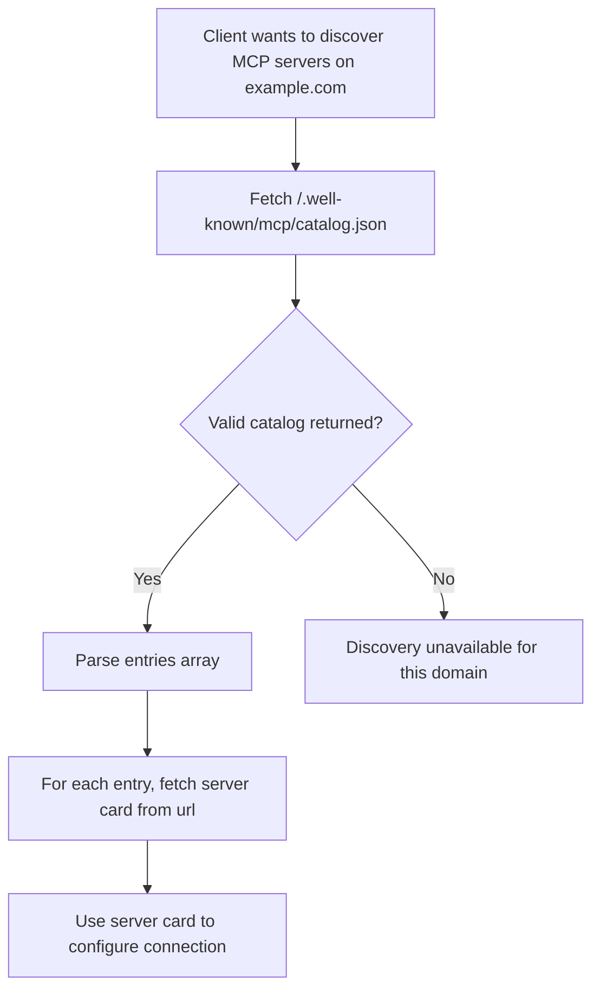

# Discovery

**Protocol Revision**: draft

MCP defines a discovery mechanism that enables clients to find available MCP servers on a
domain without prior configuration. This mechanism complements the lifecycle handshake by
answering _where_ to connect, before the protocol establishes _how_ to communicate.

## MCP Catalog

An **MCP Catalog** is a JSON document published by an organization to advertise the
[MCP Server Cards](#mcp-server-cards) relevant to its services.

The catalog MAY reference servers on different domains than the catalog itself — for
example, `acme.org/.well-known/...` MAY advertise servers operated by
`mcp-server-host-saas.com` on Acme's behalf. Clients can fetch this document to discover
servers and then retrieve individual [Server Cards](#mcp-server-cards) for connection
details.

The MCP Catalog format is a minimal, MCP-scoped subset of the
[AI Catalog](https://github.com/Agent-Card/ai-catalog) specification. This alignment
ensures that MCP Catalog entries can be used as-is within a full AI Catalog document,
enabling a smooth migration path when the cross-protocol AI Catalog standard is finalized.

### Well-Known URI

Organizations offering services accessible via MCP SHOULD publish an MCP Catalog at the
domain users associate with the service. The MCP Catalog should live at:

```
/.well-known/mcp/catalog.json
```

This endpoint:

- MUST be accessible via HTTPS (HTTP MAY be supported for local/development use)
- MUST include appropriate CORS headers (see [CORS Requirements](#cors-requirements))
- SHOULD include appropriate caching headers (see [Caching](#caching))

### Catalog Format

An MCP Catalog document is a JSON object that MUST contain the following members:

| Member        | Type   | Required | Description                                                 |
| :------------ | :----- | :------- | :---------------------------------------------------------- |
| `specVersion` | string | Yes      | The version of the MCP Catalog format (currently `"draft"`) |
| `entries`     | array  | Yes      | An array of Catalog Entry objects. This array MAY be empty. |

#### Catalog Entry

Each entry in the `entries` array describes a single MCP server and MUST contain:

| Member        | Type   | Required | Description                                                                      |
| :------------ | :----- | :------- | :------------------------------------------------------------------------------- |
| `identifier`  | string | Yes      | A URN identifying this server (e.g., `urn:mcp:server:com.example/weather`)       |
| `displayName` | string | Yes      | A human-readable name for the server                                             |
| `mediaType`   | string | Yes      | The media type of the referenced artifact. MUST be `application/mcp-server+json` |
| `url`         | string | Yes      | URL where the full [Server Card](#mcp-server-cards) can be retrieved             |

The `identifier` MUST begin with `urn:mcp:server:` and end with the `name` value of the
referenced Server Card, with no characters in between.

### Example: Single Server

A domain hosting a single MCP server, using only the required fields:

```json
{
  "specVersion": "draft",
  "entries": [
    {
      "identifier": "urn:mcp:server:com.example/weather",
      "displayName": "Weather Service",
      "mediaType": "application/mcp-server+json",
      "url": "https://example.com/mcp/server-card"
    }
  ]
}
```

### Example: Multiple Servers

A domain hosting several MCP servers, each with its own server card:

```json
{
  "specVersion": "draft",
  "entries": [
    {
      "identifier": "urn:mcp:server:com.acme/code-review",
      "displayName": "Code Review Assistant",
      "mediaType": "application/mcp-server+json",
      "url": "https://acme.com/code-review/server-card"
    },
    {
      "identifier": "urn:mcp:server:com.acme/docs-search",
      "displayName": "Documentation Search",
      "mediaType": "application/mcp-server+json",
      "url": "https://acme.com/docs-search/server-card"
    },
    {
      "identifier": "urn:mcp:server:com.acme/ci-cd",
      "displayName": "CI/CD Pipeline",
      "mediaType": "application/mcp-server+json",
      "url": "https://acme.com/ci-cd/server-card"
    }
  ]
}
```

## Client Discovery Flow

Clients performing domain-level discovery SHOULD follow this procedure:



1. Fetch `https://{domain}/.well-known/mcp/catalog.json`
2. If a valid MCP Catalog is returned, iterate over the `entries` array
3. For each entry, retrieve the server card from the entry's `url`, expressing the
   Server Card media type via the `Accept` header (see
   [Server Card Location](#server-card-location))
4. Use the server card metadata to configure and establish an MCP connection

Clients SHOULD validate that each entry has `mediaType` set to `application/mcp-server+json`
and ignore entries with unrecognized media types.

## MCP Server Cards

An **MCP Server Card** is a JSON document that describes a single MCP server — its
identity, capabilities, and connection details. Server Cards use the media type
`application/mcp-server+json`.

A Server Card includes:

- **`name`** — A unique identifier for the server in reverse DNS format (e.g., `com.example/weather`)
- **Connection details** — Transport type and endpoint URL
- **Capabilities** — Tools, resources, and prompts the server offers
- **Metadata** — Human-readable name, description, and version

For the full Server Card specification, see
[SEP-2127: MCP Server Cards](https://github.com/modelcontextprotocol/modelcontextprotocol/pull/2127).

### Server Card Location

The Catalog is the discovery entrypoint, and every Catalog Entry already carries the
`url` where its Server Card can be retrieved. Clients therefore never need to _guess_ a
Server Card's location — they follow the `url` the Catalog gives them. As a result, a
Server Card MAY be hosted at any unreserved URI.

To give servers a predictable default, MCP reserves one location:

> MCP Servers MAY host their Server Card at `GET <streamable-http-url>/server-card`,
> which we reserve for this purpose, though any unreserved URI is valid. MCP Servers
> SHOULD respect the agreed media type wherever they choose to host it. After a client
> identifies a Server Card URL from an AI Catalog or MCP Catalog, it SHOULD request that
> URL expressing the Server Card media type.

Concretely:

- A client requesting a Server Card SHOULD send `Accept: application/mcp-server+json`
  on the GET request. (`Accept` is the representation-negotiation header for a GET; the
  server echoes the negotiated type back in the response `Content-Type`.)
- The `/server-card` suffix is appended to the server's **streamable-HTTP URL**, not to
  the domain root. A server that lives at `https://host/mcp` therefore naturally yields
  `https://host/mcp/server-card` — you get path-namespacing for free without inventing a
  separate convention.

#### Alternatives considered

The following placements were considered and **not** recommended:

- **A `.well-known` URI** (e.g., `/.well-known/mcp/server-card`). `.well-known` is for
  _site-wide_ metadata, whereas an individual server's card is _application-level_
  metadata. Because the Catalog is the discovery entrypoint and already provides each
  card's `url`, hosting the card under `.well-known` adds no value — the card can live
  anywhere the Catalog points. (Note: `.well-known` remains correct for the **Catalog**
  itself at `/.well-known/mcp/catalog.json` and for OAuth metadata such as
  `/.well-known/oauth-protected-resource` — those are genuinely site-wide. This change
  applies only to the single-server Server Card.)
- **The bare streamable-HTTP endpoint** (`GET <streamable-http-url>` with no suffix).
  In the Streamable HTTP transport a `GET` on the MCP endpoint already has a reserved
  meaning — it opens the SSE stream. Serving the card there overloads that endpoint and
  forces content negotiation to disambiguate "give me the card" from "open the stream."
  This remains spec-_allowed_ (any unreserved URI is valid) but is explicitly **not
  recommended**; avoiding the overload of the connection-establishing endpoint is the
  primary motivation for reserving a distinct `/server-card` suffix.
- **Nesting under a domain-root `/mcp/`** (e.g., `/mcp/server-card`). In MCP, `/mcp` denotes
  the _transport endpoint itself_ (canonical-URI examples: `https://mcp.example.com/mcp`,
  `https://mcp.example.com/server/mcp`). There is no precedent for `/mcp/` as a metadata
  sub-namespace relative to a server URL. Nesting under `/mcp/` collides conceptually with
  "the JSON-RPC endpoint" and creates ambiguity about whether the path is relative to the
  server URL or the domain root. (This is distinct from a server that simply happens to
  live at `https://host/mcp`: there, `https://host/mcp/server-card` is just
  `<streamable-http-url>` + `/server-card` — the recommended convention — not a domain-root
  `/mcp/` metadata namespace.)

## Relationship to AI Catalog

The MCP Catalog is designed as a transitional mechanism. The
[AI Catalog](https://github.com/Agent-Card/ai-catalog) specification defines a
cross-protocol discovery standard (`/.well-known/ai-catalog.json`) capable of indexing
MCP servers, A2A agents, and other AI artifacts.

MCP Catalog entries are structurally compatible with AI Catalog entries. When the AI
Catalog standard is finalized and adopted by the MCP steering committee:

1. Domains MAY serve both `/.well-known/mcp/catalog.json` and `/.well-known/ai-catalog.json`
   during a transition period
2. MCP Catalog entries can be included directly in an AI Catalog document without
   modification
3. Domains that want richer metadata (trust manifests, publisher identity, collections)
   can adopt the full AI Catalog format

## Security Considerations

### Information Disclosure

MCP Catalogs are publicly accessible by design. Catalog entries MUST NOT include sensitive
information such as:

- Authentication credentials or tokens
- Internal network topology or private endpoints
- Proprietary business logic

### CORS Requirements

Discovery endpoints MUST include appropriate CORS headers to allow browser-based clients:

```
Access-Control-Allow-Origin: *
Access-Control-Allow-Methods: GET
Access-Control-Allow-Headers: Content-Type
```

This is safe because MCP Catalogs contain only public metadata and are read-only.

### Caching

Servers SHOULD include caching headers to reduce unnecessary requests:

```
Cache-Control: public, max-age=3600
```

### Transport Security

MCP Catalogs MUST be served over HTTPS (TLS 1.2 or later) in production. HTTP MAY be
used for local development only.
