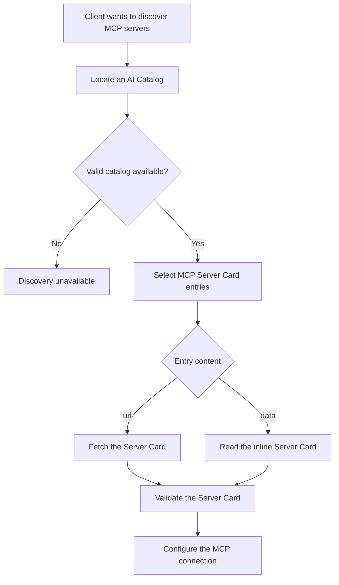

# Discovery

**Protocol Revision**: draft

MCP Server Cards describe where and how to connect to MCP servers before any protocol
exchange. Clients discover Server Cards through an
[AI Catalog](https://github.com/Agent-Card/ai-catalog).

## AI Catalog

An AI Catalog is a typed container for discovering heterogeneous AI artifacts. Catalog
entries for MCP Server Cards use the `application/mcp-server-card+json` media type and
either reference a hosted card by URL or include the card inline. The AI Catalog
specification defines the catalog format, publication locations, and discovery behavior.

Clients discovering MCP servers from an AI Catalog SHOULD select entries whose `type` is
`application/mcp-server-card+json` and ignore entries with other media types.

## Client Discovery Flow

Clients discovering MCP servers through an AI Catalog SHOULD follow this procedure:

1. Locate and validate an AI Catalog according to the AI Catalog specification.
2. Select entries whose `type` is `application/mcp-server-card+json`.
3. For a `url` entry, retrieve the Server Card from that URL, expressing the Server Card
   media type via the `Accept` header (see
   [Hosted Server Card Location](#hosted-server-card-location)). For a `data` entry, use
   the inline Server Card.
4. Validate the Server Card and use its metadata to configure and establish an MCP
   connection.

## MCP Server Cards

An **MCP Server Card** is a JSON document that describes a single MCP server — its
identity and connection details. Server Cards use the media type
`application/mcp-server-card+json`.

Server Cards do not enumerate primitives (tools, resources, prompts); those remain
subject to runtime listing via the protocol's standard list operations.

A Server Card includes:

- **`name`** — A unique identifier for the server in reverse DNS format (e.g., `com.example/weather`)
- **Connection details** — Transport type and endpoint URL
- **Metadata** — Human-readable name, description, and version

For the full Server Card specification, see
[SEP-2127: MCP Server Cards](https://github.com/modelcontextprotocol/modelcontextprotocol/pull/2127).

### Consistency with Runtime Behavior

A Server Card is fetched _before_ the client connects, so its contents are unverified when
read. A Server Card SHOULD accurately reflect the server's runtime behavior: the values a
client observes once connected — the `serverInfo` (`name`, `version`) and `supportedVersions`
from [`server/discover`](https://modelcontextprotocol.io/specification/draft/server/discover),
the transport served at each `remotes[]` endpoint, and descriptive fields (`title`,
`description`, `icons`) — SHOULD NOT contradict the equivalent values declared in the Server
Card.

As with the deliberately omitted primitives (tools, resources, prompts), a static manifest
can drift from runtime, so even the fields a Server Card does declare are advisory rather
than binding. Accordingly:

- Clients MUST NOT treat Server Card contents as authoritative for security or
  access-control decisions.
- Clients SHOULD verify a Server Card's claims against the live connection, preferring the
  runtime values where the two disagree.

### Hosted Server Card Location

An AI Catalog entry with a `url` provides the exact location of its Server Card, so clients
never need to guess where a hosted card lives. A Server Card MAY therefore be hosted at any
unreserved URI. An AI Catalog entry with `data` includes the Server Card inline and does
not require a hosted location.

To give servers a predictable default, MCP reserves one location:

> MCP Servers MAY host their Server Card at `GET <streamable-http-url>/server-card`,
> which we reserve for this purpose, though any unreserved URI (on any domain) is valid.
> MCP Servers SHOULD respect the `application/mcp-server-card+json` media type wherever
> they choose to host it. After a client identifies a Server Card URL from an AI Catalog,
> it SHOULD request that URL expressing the `application/mcp-server-card+json` media type.

Concretely:

- A client requesting a Server Card SHOULD send `Accept: application/mcp-server-card+json`
  on the GET request. (`Accept` is the representation-negotiation header for a GET; the
  server echoes the negotiated type back in the response `Content-Type`.)
- The `/server-card` suffix is appended to the server's **streamable-HTTP URL**, not to
  the domain root. A server that lives at `https://host/mcp` therefore naturally yields
  `https://host/mcp/server-card` — you get path-namespacing for free without inventing a
  separate convention.

#### Alternatives considered

The following placements were considered and **not** recommended:

- **A `.well-known` URI** (e.g., `/.well-known/mcp/server-card`). `.well-known` is for
  _site-wide_ metadata, whereas an individual server's card is _application-level_
  metadata. AI Catalog entries already provide each hosted card's URL, so an individual
  card can live anywhere its entry points. `.well-known` remains appropriate for
  site-wide metadata such as AI Catalog and OAuth metadata.
- **The bare streamable-HTTP endpoint** (`GET <streamable-http-url>` with no suffix).
  In the Streamable HTTP transport a `GET` on the MCP endpoint already has a reserved
  meaning — it opens the SSE stream. Serving the card there overloads that endpoint and
  forces content negotiation to disambiguate "give me the card" from "open the stream."
  This remains spec-_allowed_ (any unreserved URI is valid) but is explicitly **not
  recommended**; avoiding the overload of the connection-establishing endpoint is the
  primary motivation for reserving a distinct `/server-card` suffix.
- **Nesting under a domain-root `/mcp/`** (e.g., `/mcp/server-card`). In MCP, `/mcp` denotes
  the _transport endpoint itself_ (canonical-URI examples: `https://mcp.example.com/mcp`,
  `https://mcp.example.com/server/mcp`). There is no precedent for `/mcp/` as a metadata
  sub-namespace relative to a server URL. Nesting under `/mcp/` collides conceptually with
  "the JSON-RPC endpoint" and creates ambiguity about whether the path is relative to the
  server URL or the domain root. (This is distinct from a server that simply happens to
  live at `https://host/mcp`: there, `https://host/mcp/server-card` is just
  `<streamable-http-url>` + `/server-card` — the recommended convention — not a domain-root
  `/mcp/` metadata namespace.)

## Security Considerations

### Server Card Accuracy

A Server Card is consumed before the client connects, so an inaccurate one — stale or
deliberately crafted — is a mild confusion or downgrade vector: one that overstates
transport or protocol-version support, or misrepresents the server's identity, can steer a
client toward a weaker configuration or the wrong server before it observes the actual
`server/discover` response. This makes the consistency requirement partly a security
property, not merely a matter of correctness. The normative protections live in
[Consistency with Runtime Behavior](#consistency-with-runtime-behavior): clients do not
treat a Server Card as authoritative and reconcile it against the live connection.

### Denial of Service

Server Card hosts SHOULD implement rate limiting on their endpoints to prevent abuse.

MCP Clients SHOULD respect `Cache-Control` headers and avoid unnecessary polling.
