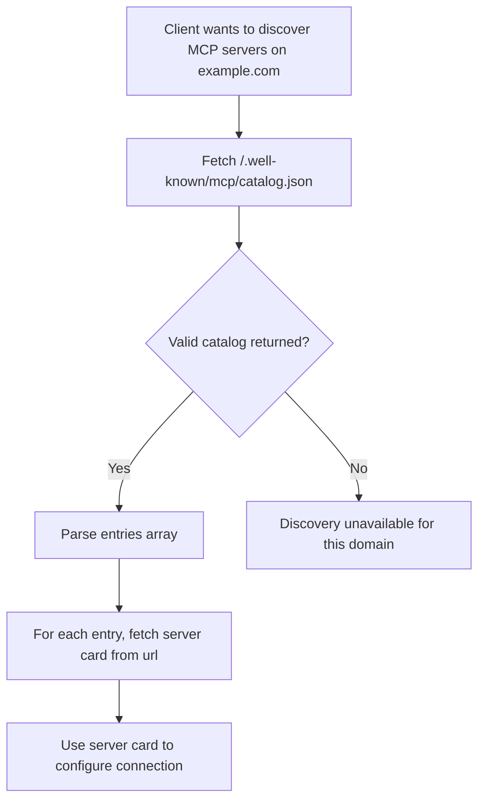

# Discovery

**Protocol Revision**: draft

MCP defines a discovery mechanism that enables clients to find available MCP servers on a
domain without prior configuration. This mechanism complements the lifecycle handshake by
answering _where_ to connect, before the protocol establishes _how_ to communicate.

## MCP Catalog

An **MCP Catalog** is a JSON document published by an organization to advertise the
[MCP Server Cards](#mcp-server-cards) relevant to its services.

The catalog MAY reference servers on different domains than the catalog itself — for
example, `acme.org/.well-known/...` MAY advertise servers operated by
`mcp-server-host-saas.com` on Acme's behalf. Clients can fetch this document to discover
servers and then retrieve individual [Server Cards](#mcp-server-cards) for connection
details.

The MCP Catalog format is a minimal, MCP-scoped subset of the
[AI Catalog](https://github.com/Agent-Card/ai-catalog) specification. This alignment
ensures that MCP Catalog entries can be used as-is within a full AI Catalog document,
enabling a smooth migration path when the cross-protocol AI Catalog standard is finalized.

### Well-Known URI

Organizations offering services accessible via MCP SHOULD publish an MCP Catalog at the
domain users associate with the service. The MCP Catalog should live at:

```
/.well-known/mcp/catalog.json
```

This endpoint:

- MUST be accessible via HTTPS (HTTP MAY be supported for local/development use)
- MUST include appropriate CORS headers (see [CORS Requirements](#cors-requirements))
- SHOULD include appropriate caching headers (see [Caching](#caching))

### Catalog Format

An MCP Catalog document is a JSON object that MUST contain the following members:

| Member        | Type   | Required | Description                                                 |
| :------------ | :----- | :------- | :---------------------------------------------------------- |
| `specVersion` | string | Yes      | The version of the MCP Catalog format (currently `"draft"`) |
| `entries`     | array  | Yes      | An array of Catalog Entry objects. This array MAY be empty. |

#### Catalog Entry

Each entry in the `entries` array describes a single MCP server and MUST contain:

| Member        | Type   | Required | Description                                                                           |
| :------------ | :----- | :------- | :------------------------------------------------------------------------------------ |
| `identifier`  | string | Yes      | A URN identifying this server (e.g., `urn:mcp:server:com.example/weather`)            |
| `displayName` | string | Yes      | A human-readable name for the server                                                  |
| `mediaType`   | string | Yes      | The media type of the referenced artifact. MUST be `application/mcp-server-card+json` |
| `url`         | string | Yes      | URL where the full [Server Card](#mcp-server-cards) can be retrieved                  |

The `identifier` MUST begin with `urn:mcp:server:` and end with the `name` value of the
referenced Server Card, with no characters in between.

### Example: Single Server

A domain hosting a single MCP server, using only the required fields:

```json
{
  "specVersion": "draft",
  "entries": [
    {
      "identifier": "urn:mcp:server:com.example/weather",
      "displayName": "Weather Service",
      "mediaType": "application/mcp-server-card+json",
      "url": "https://example.com/.well-known/mcp-server-card"
    }
  ]
}
```

### Example: Multiple Servers

A domain hosting several MCP servers, each with its own server card:

```json
{
  "specVersion": "draft",
  "entries": [
    {
      "identifier": "urn:mcp:server:com.acme/code-review",
      "displayName": "Code Review Assistant",
      "mediaType": "application/mcp-server-card+json",
      "url": "https://acme.com/.well-known/mcp-server-card/code-review"
    },
    {
      "identifier": "urn:mcp:server:com.acme/docs-search",
      "displayName": "Documentation Search",
      "mediaType": "application/mcp-server-card+json",
      "url": "https://acme.com/.well-known/mcp-server-card/docs-search"
    },
    {
      "identifier": "urn:mcp:server:com.acme/ci-cd",
      "displayName": "CI/CD Pipeline",
      "mediaType": "application/mcp-server-card+json",
      "url": "https://acme.com/.well-known/mcp-server-card/ci-cd"
    }
  ]
}
```

## Client Discovery Flow

Clients performing domain-level discovery SHOULD follow this procedure:



1. Fetch `https://{domain}/.well-known/mcp/catalog.json`
2. If a valid MCP Catalog is returned, iterate over the `entries` array
3. For each entry, retrieve the server card from the entry's `url`
4. Use the server card metadata to configure and establish an MCP connection

Clients SHOULD validate that each entry has `mediaType` set to `application/mcp-server-card+json`
and ignore entries with unrecognized media types.

## MCP Server Cards

An **MCP Server Card** is a JSON document that describes a single MCP server — its
identity and connection details. Server Cards use the media type
`application/mcp-server-card+json`.

Server Cards do not enumerate primitives (tools, resources, prompts); those remain
subject to runtime listing via the protocol's standard list operations.

A Server Card includes:

- **`name`** — A unique identifier for the server in reverse DNS format (e.g., `com.example/weather`)
- **Connection details** — Transport type and endpoint URL
- **Metadata** — Human-readable name, description, and version

For the full Server Card specification, see
[SEP-2127: MCP Server Cards](https://github.com/modelcontextprotocol/modelcontextprotocol/pull/2127).

## Relationship to AI Catalog

The MCP Catalog is designed as a transitional mechanism. The
[AI Catalog](https://github.com/Agent-Card/ai-catalog) specification defines a
cross-protocol discovery standard (`/.well-known/ai-catalog.json`) capable of indexing
MCP servers, A2A agents, and other AI artifacts.

MCP Catalog entries are structurally compatible with AI Catalog entries. When the AI
Catalog standard is finalized and adopted by the MCP steering committee:

1. Domains MAY serve both `/.well-known/mcp/catalog.json` and `/.well-known/ai-catalog.json`
   during a transition period
2. MCP Catalog entries can be included directly in an AI Catalog document without
   modification
3. Domains that want richer metadata (trust manifests, publisher identity, collections)
   can adopt the full AI Catalog format

## Security Considerations

### Information Disclosure

MCP Catalogs are publicly accessible by design. Catalog entries MUST NOT include sensitive
information such as:

- Authentication credentials or tokens
- Internal network topology or private endpoints
- Proprietary business logic

### CORS Requirements

Discovery endpoints MUST include appropriate CORS headers to allow browser-based clients:

```
Access-Control-Allow-Origin: *
Access-Control-Allow-Methods: GET
Access-Control-Allow-Headers: Content-Type
```

This is safe because MCP Catalogs contain only public metadata and are read-only.

### Caching

Servers SHOULD include caching headers to reduce unnecessary requests:

```
Cache-Control: public, max-age=3600
```

### Transport Security

MCP Catalogs MUST be served over HTTPS (TLS 1.2 or later) in production. HTTP MAY be
used for local development only.
