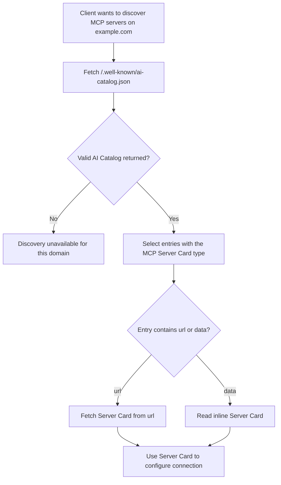

# Discovery

**Protocol Revision**: draft

MCP defines a discovery mechanism that enables clients to find available MCP servers on a
domain without prior configuration. This mechanism answers _where_ to connect, before any
protocol exchange establishes _how_ to communicate.

## AI Catalog

An [AI Catalog](https://github.com/Agent-Card/ai-catalog) is a JSON document published by
an organization to advertise AI artifacts, including the
[MCP Server Cards](#mcp-server-cards) relevant to its services.

The catalog MAY reference Server Cards on different domains than the catalog itself — for
example, an AI Catalog on `acme.org` MAY advertise servers operated by
`mcp-server-host-saas.com` on Acme's behalf. Clients can fetch the catalog to discover
servers and then retrieve individual Server Cards for connection details.

### Well-Known URI

An AI Catalog MAY be served from any URL. For automated domain-level discovery, hosts MAY
publish one at:

```
/.well-known/ai-catalog.json
```

Clients performing domain-level discovery SHOULD attempt to retrieve this well-known URL.
When served over HTTP, the document SHOULD use the `application/ai-catalog+json` media
type.

### Server Card Entries

The [AI Catalog specification](https://github.com/Agent-Card/ai-catalog) defines the full
catalog and entry formats. An entry for an MCP Server Card has:

| Member       | Required | Description                                                                                           |
| :----------- | :------- | :---------------------------------------------------------------------------------------------------- |
| `identifier` | Yes      | A logical discovery identifier for this server                                                        |
| `type`       | Yes      | MUST be `application/mcp-server-card+json`                                                            |
| `url`        | One of   | URL where the full [Server Card](#mcp-server-cards) can be retrieved                                  |
| `data`       | One of   | The complete [Server Card](#mcp-server-cards) included inline; exactly one of `url` or `data` is used |

For open or federated systems, AI Catalog identifiers use the domain-anchored format:

```
urn:air:{publisher}:{namespace}:{name}
```

For example, a Server Card named `com.example/weather` can use the catalog identifier
`urn:air:example.com:mcp:weather`.

An entry does not need to repeat the Server Card's human-readable fields. Clients can read
the server's `title`, `description`, and `version` from the card itself, avoiding duplicated
values that could drift out of sync.

### Example: Single Server

A domain advertising a single MCP server:

```json
{
  "specVersion": "1.0",
  "entries": [
    {
      "identifier": "urn:air:example.com:mcp:weather",
      "type": "application/mcp-server-card+json",
      "url": "https://example.com/mcp/server-card"
    }
  ]
}
```

### Example: Multiple Servers

A domain advertising several MCP servers, each with its own Server Card:

```json
{
  "specVersion": "1.0",
  "entries": [
    {
      "identifier": "urn:air:acme.com:mcp:code-review",
      "type": "application/mcp-server-card+json",
      "url": "https://acme.com/code-review/server-card"
    },
    {
      "identifier": "urn:air:acme.com:mcp:docs-search",
      "type": "application/mcp-server-card+json",
      "url": "https://acme.com/docs-search/server-card"
    },
    {
      "identifier": "urn:air:acme.com:mcp:ci-cd",
      "type": "application/mcp-server-card+json",
      "url": "https://acme.com/ci-cd/server-card"
    }
  ]
}
```

## Client Discovery Flow

Clients performing domain-level discovery SHOULD follow this procedure:



1. Fetch `https://{domain}/.well-known/ai-catalog.json`
2. If a valid AI Catalog is returned, select entries whose `type` is
   `application/mcp-server-card+json`
3. For an entry with `url`, retrieve the Server Card from that URL, expressing the Server
   Card media type via the `Accept` header (see
   [Hosted Server Card Location](#hosted-server-card-location)); for an entry with `data`,
   use the inline Server Card
4. Use the Server Card metadata to configure and establish an MCP connection

## MCP Server Cards

An **MCP Server Card** is a JSON document that describes a single MCP server — its
identity and connection details. Server Cards use the media type
`application/mcp-server-card+json`.

Server Cards do not enumerate primitives (tools, resources, prompts); those remain
subject to runtime listing via the protocol's standard list operations.

A Server Card includes:

- **`name`** — A unique identifier for the server in reverse DNS format (e.g., `com.example/weather`)
- **Connection details** — Transport type and endpoint URL
- **Metadata** — Human-readable name, description, and version

For the full Server Card specification, see
[SEP-2127: MCP Server Cards](https://github.com/modelcontextprotocol/modelcontextprotocol/pull/2127).

### Consistency with Runtime Behavior

A Server Card is fetched _before_ the client connects, so its contents are unverified when
read. A Server Card SHOULD accurately reflect the server's runtime behavior: the values a
client observes once connected — the `serverInfo` (`name`, `version`) and `supportedVersions`
from [`server/discover`](https://modelcontextprotocol.io/specification/draft/server/discover),
the transport served at each `remotes[]` endpoint, and descriptive fields (`title`,
`description`, `icons`) — SHOULD NOT contradict the equivalent values declared in the Server
Card.

As with the deliberately omitted primitives (tools, resources, prompts), a static manifest
can drift from runtime, so even the fields a Server Card does declare are advisory rather
than binding. Accordingly:

- Clients MUST NOT treat Server Card contents as authoritative for security or
  access-control decisions.
- Clients SHOULD verify a Server Card's claims against the live connection, preferring the
  runtime values where the two disagree.

### Hosted Server Card Location

An AI Catalog entry with `url` carries the exact location where its Server Card can be
retrieved. Clients therefore never need to _guess_ a hosted Server Card's location — they
follow the `url` the catalog gives them. As a result, a Server Card MAY be hosted at any
unreserved URI. An entry with `data` carries the Server Card inline instead.

To give servers a predictable default, MCP reserves one location:

> MCP Servers MAY host their Server Card at `GET <streamable-http-url>/server-card`,
> which we reserve for this purpose, though any unreserved URI (on any domain) is valid.
> MCP Servers SHOULD respect the `application/mcp-server-card+json` media type wherever
> they choose to host it. After a client identifies a Server Card URL from an AI Catalog,
> it SHOULD request that URL expressing the `application/mcp-server-card+json` media type.

Concretely:

- A client requesting a Server Card SHOULD send `Accept: application/mcp-server-card+json`
  on the GET request. (`Accept` is the representation-negotiation header for a GET; the
  server echoes the negotiated type back in the response `Content-Type`.)
- The `/server-card` suffix is appended to the server's **streamable-HTTP URL**, not to
  the domain root. A server that lives at `https://host/mcp` therefore naturally yields
  `https://host/mcp/server-card` — you get path-namespacing for free without inventing a
  separate convention.

#### Alternatives considered

The following placements were considered and **not** recommended:

- **A `.well-known` URI** (e.g., `/.well-known/mcp/server-card`). `.well-known` is for
  _site-wide_ metadata, whereas an individual server's card is _application-level_
  metadata. Because the AI Catalog already provides each hosted card's `url`, hosting the
  card under `.well-known` adds no value — the card can live anywhere the catalog points.
  `.well-known` remains correct for the AI Catalog itself at
  `/.well-known/ai-catalog.json` and for OAuth metadata such as
  `/.well-known/oauth-protected-resource`; those are genuinely site-wide.
- **The bare streamable-HTTP endpoint** (`GET <streamable-http-url>` with no suffix).
  In the Streamable HTTP transport a `GET` on the MCP endpoint already has a reserved
  meaning — it opens the SSE stream. Serving the card there overloads that endpoint and
  forces content negotiation to disambiguate "give me the card" from "open the stream."
  This remains spec-_allowed_ (any unreserved URI is valid) but is explicitly **not
  recommended**; avoiding the overload of the connection-establishing endpoint is the
  primary motivation for reserving a distinct `/server-card` suffix.
- **Nesting under a domain-root `/mcp/`** (e.g., `/mcp/server-card`). In MCP, `/mcp` denotes
  the _transport endpoint itself_ (canonical-URI examples: `https://mcp.example.com/mcp`,
  `https://mcp.example.com/server/mcp`). There is no precedent for `/mcp/` as a metadata
  sub-namespace relative to a server URL. Nesting under `/mcp/` collides conceptually with
  "the JSON-RPC endpoint" and creates ambiguity about whether the path is relative to the
  server URL or the domain root. (This is distinct from a server that simply happens to
  live at `https://host/mcp`: there, `https://host/mcp/server-card` is just
  `<streamable-http-url>` + `/server-card` — the recommended convention — not a domain-root
  `/mcp/` metadata namespace.)

## Security Considerations

### Information Disclosure

AI Catalogs and Server Cards used for public discovery are publicly accessible by design.
They MUST NOT include sensitive information such as:

- Authentication credentials or tokens
- Internal network topology or private endpoints
- Proprietary business logic

### Server Card Accuracy

A Server Card is consumed before the client connects, so an inaccurate one — stale or
deliberately crafted — is a mild confusion or downgrade vector: one that overstates
transport or protocol-version support, or misrepresents the server's identity, can steer a
client toward a weaker configuration or the wrong server before it observes the actual
`server/discover` response. This makes the consistency requirement partly a security
property, not merely a matter of correctness. The normative protections live in
[Consistency with Runtime Behavior](#consistency-with-runtime-behavior): clients do not
treat a Server Card as authoritative and reconcile it against the live connection.

### CORS Requirements

Hosted AI Catalog and Server Card endpoints MUST include appropriate CORS headers to allow
browser-based clients:

```
Access-Control-Allow-Origin: *
Access-Control-Allow-Methods: GET
Access-Control-Allow-Headers: Content-Type, If-None-Match
Access-Control-Expose-Headers: ETag
```

This is safe because these documents contain only public metadata and are read-only.

### Caching

Hosts serving AI Catalogs or Server Cards SHOULD include caching headers to reduce unnecessary
requests:

```
Cache-Control: public, max-age=3600
```

Hosts SHOULD also return an `ETag` response header. Entity tags are opaque HTTP validators; this
specification does not prescribe their form.

After receiving an `ETag`, clients SHOULD send its value in the `If-None-Match` header on
subsequent requests for the same resource. Hosts SHOULD honor `If-None-Match` and return
`304 Not Modified` when the selected representation has not changed. This complements
`Cache-Control`: fresh responses avoid requests, while entity-tag validation avoids transferring
an unchanged document after it becomes stale.

MCP Clients SHOULD respect `Cache-Control` headers and avoid unnecessary polling.

### Transport Security

Hosted Server Cards MUST be served over HTTPS (TLS 1.2 or later) in production. HTTP MAY
be used for local development only.

### Denial of Service

MCP Servers SHOULD implement rate limiting on their Server Card endpoint to prevent abuse.
