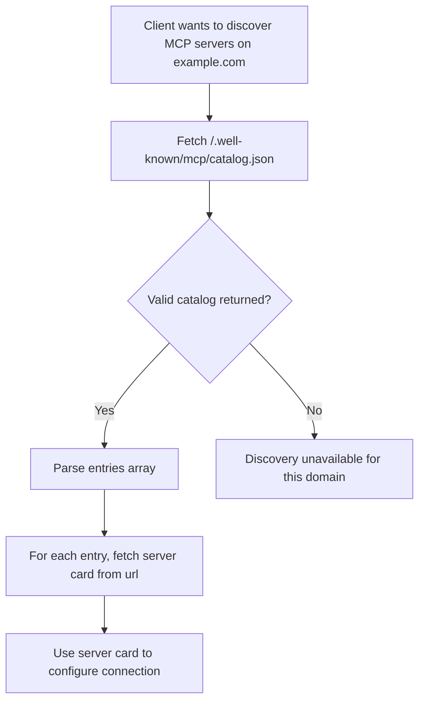

# Discovery

**Protocol Revision**: draft

MCP defines a discovery mechanism that enables clients to find available MCP servers on a
domain without prior configuration. This mechanism answers _where_ to connect, before any
protocol exchange establishes _how_ to communicate.

## MCP Catalog

An **MCP Catalog** is a JSON document published by an organization to advertise the
[MCP Server Cards](#mcp-server-cards) relevant to its services.

The catalog MAY reference servers on different domains than the catalog itself — for
example, `acme.org/.well-known/...` MAY advertise servers operated by
`mcp-server-host-saas.com` on Acme's behalf. Clients can fetch this document to discover
servers and then retrieve individual [Server Cards](#mcp-server-cards) for connection
details.

The MCP Catalog format is a minimal, MCP-scoped subset of the
[AI Catalog](https://github.com/Agent-Card/ai-catalog) specification. This alignment
ensures that MCP Catalog entries can be used as-is within a full AI Catalog document,
enabling a smooth migration path when the cross-protocol AI Catalog standard is finalized.

### Well-Known URI

Organizations offering services accessible via MCP SHOULD publish an MCP Catalog at the
domain users associate with the service. The MCP Catalog should live at:

```
/.well-known/mcp/catalog.json
```

This endpoint:

- MUST be accessible via HTTPS (HTTP MAY be supported for local/development use)
- MUST include appropriate CORS headers (see [CORS Requirements](#cors-requirements))
- SHOULD include appropriate caching headers (see [Caching](#caching))

### Optional DNS Bootstrap

Clients MAY use DNS as an optional bootstrap mechanism to locate an MCP Catalog for a
domain before, or in parallel with, fetching `/.well-known/mcp/catalog.json`.

DNS bootstrap is not a replacement for the MCP Catalog, and does not encode MCP Server
Cards directly in DNS. Instead, DNS provides an authoritative, cache-friendly pointer to
one of:

- an HTTPS URL for an MCP Catalog;
- an HTTPS URL for an AI Catalog that contains MCP Catalog-compatible entries; or
- a DNS-published services document that identifies MCP Catalog and/or Server Card URLs.

This distinction avoids the main limitation of DNS-only discovery. DNS answers "where is
the discovery document for this domain?" The Catalog answers "which MCP servers are
relevant, and where are their Server Cards?" This preserves support for path-based,
port-based, multi-server, and third-party-hosted MCP deployments.

One possible substrate for DNS bootstrap is
[Intelligence-over-DNS (IOD)](https://github.com/markjr/Intelligence-over-DNS), which
defines DNSSEC-backed publication of structured, machine-readable service metadata using
DNS TXT records. This extension does not require IOD as a normative dependency; it is
provided as an example of how DNS-published service metadata can point to MCP discovery
documents without putting Server Cards themselves in DNS.

For example, a domain could publish an IOD-style services document:

```dns
_iod.example.com. TXT "v=1; idx=_iod.index; alg=jcs+jws; enc=zstd+b64url; dnssec=required"
_iod.index.example.com. TXT "id=services;type=services;hash=...;ttl=3600"
```

The decoded services document could then contain URLs for MCP Catalogs and related Server
Cards:

```json
{
  "iod_version": "1.0",
  "zone": "example.com",
  "services": {
    "mcp_catalogs": [
      {
        "url": "https://example.com/.well-known/mcp/catalog.json"
      }
    ],
    "mcp_servers": [
      {
        "role": "primary",
        "url": "https://mcp.example.com",
        "serverCardUrl": "https://mcp.example.com/weather/server-card"
      }
    ]
  },
  "last_updated": "2026-06-17T00:00:00Z"
}
```

Clients that implement DNS bootstrap:

- MUST still validate HTTPS, media types, and schema conformance for fetched Catalogs and
  Server Cards.
- MUST validate DNSSEC when the selected DNS discovery mechanism requires DNSSEC.
- MUST NOT treat DNS-discovered metadata as authorization or as authoritative for
  access-control decisions.
- SHOULD fall back to `/.well-known/mcp/catalog.json` when no usable DNS bootstrap metadata
  exists.

### Catalog Format

An MCP Catalog document is a JSON object that MUST contain the following members:

| Member        | Type   | Required | Description                                                 |
| :------------ | :----- | :------- | :---------------------------------------------------------- |
| `specVersion` | string | Yes      | The version of the MCP Catalog format (currently `"draft"`) |
| `entries`     | array  | Yes      | An array of Catalog Entry objects. This array MAY be empty. |

#### Catalog Entry

Each entry in the `entries` array describes a single MCP server and MUST contain:

| Member        | Type   | Required | Description                                                  |
| :------------ | :----- | :------- | :----------------------------------------------------------- |
| `identifier`  | string | Yes      | A logical discovery URN for this server (e.g., `urn:air:example.com:weather`) |
| `displayName` | string | Yes      | A human-readable name for the server                         |
| `mediaType`   | string | Yes      | The media type of the referenced artifact. MUST be `application/mcp-server-card+json` |
| `url`         | string | Yes      | URL where the full [Server Card](#mcp-server-cards) can be retrieved |

The `identifier` is a **logical discovery name** that follows the
[AI Catalog](https://github.com/Agent-Card/ai-catalog) domain-anchored URN convention
standardized in [ADR 0015](https://github.com/Agent-Card/ai-catalog/pull/36):

```
urn:air:{publisher}:{namespace}:{name}
```

The segments are:

- **`publisher`** — the publisher's domain (forward DNS), e.g., `example.com`. ADR 0015
  anchors the identifier on this domain.
- **`namespace`** — optional, populate if you wish in accordance with the AI Catalog specification
- **`name`** — the server's name suffix, i.e. the segment after the `/` in the referenced Server
  Card's reverse-DNS `name`, e.g. `weather`.

So a Server Card named `com.example/weather`, can be referenced as
`urn:air:example.com:weather`. Anchoring the identifier on the publisher's domain keeps
it globally unique and stable across infrastructure changes, and lets an MCP Catalog entry
be indexed as-is within a full AI Catalog document.

### Example: Single Server

A domain hosting a single MCP server, using only the required fields:

```json
{
  "specVersion": "draft",
  "entries": [
    {
      "identifier": "urn:air:example.com:weather",
      "displayName": "Weather Service",
      "mediaType": "application/mcp-server-card+json",
      "url": "https://example.com/mcp/server-card"
    }
  ]
}
```

### Example: Multiple Servers

A domain hosting several MCP servers, each with its own server card:

```json
{
  "specVersion": "draft",
  "entries": [
    {
      "identifier": "urn:air:acme.com:code-review",
      "displayName": "Code Review Assistant",
      "mediaType": "application/mcp-server-card+json",
      "url": "https://acme.com/code-review/server-card"
    },
    {
      "identifier": "urn:air:acme.com:docs-search",
      "displayName": "Documentation Search",
      "mediaType": "application/mcp-server-card+json",
      "url": "https://acme.com/docs-search/server-card"
    },
    {
      "identifier": "urn:air:acme.com:ci-cd",
      "displayName": "CI/CD Pipeline",
      "mediaType": "application/mcp-server-card+json",
      "url": "https://acme.com/ci-cd/server-card"
    }
  ]
}
```

## Client Discovery Flow

Clients performing domain-level discovery SHOULD follow this procedure:



1. Fetch `https://{domain}/.well-known/mcp/catalog.json`
2. If a valid MCP Catalog is returned, iterate over the `entries` array
3. For each entry, retrieve the server card from the entry's `url`, expressing the
   Server Card media type via the `Accept` header (see
   [Server Card Location](#server-card-location))
4. Use the server card metadata to configure and establish an MCP connection

Clients MAY perform optional DNS bootstrap before, or in parallel with, step 1. If DNS
bootstrap returns a usable MCP Catalog URL, clients MAY fetch that URL instead of the
well-known URL. If DNS bootstrap fails or returns unusable metadata, clients SHOULD fall
back to `https://{domain}/.well-known/mcp/catalog.json`.

Clients SHOULD validate that each entry has `mediaType` set to `application/mcp-server-card+json`
and ignore entries with unrecognized media types.

## MCP Server Cards

An **MCP Server Card** is a JSON document that describes a single MCP server — its
identity and connection details. Server Cards use the media type
`application/mcp-server-card+json`.

Server Cards do not enumerate primitives (tools, resources, prompts); those remain
subject to runtime listing via the protocol's standard list operations.

A Server Card includes:

- **`name`** — A unique identifier for the server in reverse DNS format (e.g., `com.example/weather`)
- **Connection details** — Transport type and endpoint URL
- **Metadata** — Human-readable name, description, and version

For the full Server Card specification, see
[SEP-2127: MCP Server Cards](https://github.com/modelcontextprotocol/modelcontextprotocol/pull/2127).

### Consistency with Runtime Behavior

A Server Card is fetched _before_ the client connects, so its contents are unverified when
read. A Server Card SHOULD accurately reflect the server's runtime behavior: the values a
client observes once connected — the `serverInfo` (`name`, `version`) and `supportedVersions`
from [`server/discover`](https://modelcontextprotocol.io/specification/draft/server/discover),
the transport served at each `remotes[]` endpoint, and descriptive fields (`title`,
`description`, `icons`) — SHOULD NOT contradict the equivalent values declared in the Server
Card.

As with the deliberately omitted primitives (tools, resources, prompts), a static manifest
can drift from runtime, so even the fields a Server Card does declare are advisory rather
than binding. Accordingly:

- Clients MUST NOT treat Server Card contents as authoritative for security or
  access-control decisions.
- Clients SHOULD verify a Server Card's claims against the live connection, preferring the
  runtime values where the two disagree.

### Server Card Location

The Catalog is the discovery entrypoint, and every Catalog Entry already carries the
`url` where its Server Card can be retrieved. Clients therefore never need to _guess_ a
Server Card's location — they follow the `url` the Catalog gives them. As a result, a
Server Card MAY be hosted at any unreserved URI.

To give servers a predictable default, MCP reserves one location:

> MCP Servers MAY host their Server Card at `GET <streamable-http-url>/server-card`,
> which we reserve for this purpose, though any unreserved URI (on any domain) is valid.
> MCP Servers SHOULD respect the `application/mcp-server-card+json` media type wherever
> they choose to host it. After a client identifies a Server Card URL from an AI Catalog
> or MCP Catalog, it SHOULD request that URL expressing the `application/mcp-server-card+json`
> media type.

Concretely:

- A client requesting a Server Card SHOULD send `Accept: application/mcp-server-card+json`
  on the GET request. (`Accept` is the representation-negotiation header for a GET; the
  server echoes the negotiated type back in the response `Content-Type`.)
- The `/server-card` suffix is appended to the server's **streamable-HTTP URL**, not to
  the domain root. A server that lives at `https://host/mcp` therefore naturally yields
  `https://host/mcp/server-card` — you get path-namespacing for free without inventing a
  separate convention.

#### Alternatives considered

The following placements were considered and **not** recommended:

- **A `.well-known` URI** (e.g., `/.well-known/mcp/server-card`). `.well-known` is for
  _site-wide_ metadata, whereas an individual server's card is _application-level_
  metadata. Because the Catalog is the discovery entrypoint and already provides each
  card's `url`, hosting the card under `.well-known` adds no value — the card can live
  anywhere the Catalog points. (Note: `.well-known` remains correct for the **Catalog**
  itself at `/.well-known/mcp/catalog.json` and for OAuth metadata such as
  `/.well-known/oauth-protected-resource` — those are genuinely site-wide. This change
  applies only to the single-server Server Card.)
- **The bare streamable-HTTP endpoint** (`GET <streamable-http-url>` with no suffix).
  In the Streamable HTTP transport a `GET` on the MCP endpoint already has a reserved
  meaning — it opens the SSE stream. Serving the card there overloads that endpoint and
  forces content negotiation to disambiguate "give me the card" from "open the stream."
  This remains spec-_allowed_ (any unreserved URI is valid) but is explicitly **not
  recommended**; avoiding the overload of the connection-establishing endpoint is the
  primary motivation for reserving a distinct `/server-card` suffix.
- **Nesting under a domain-root `/mcp/`** (e.g., `/mcp/server-card`). In MCP, `/mcp` denotes
  the _transport endpoint itself_ (canonical-URI examples: `https://mcp.example.com/mcp`,
  `https://mcp.example.com/server/mcp`). There is no precedent for `/mcp/` as a metadata
  sub-namespace relative to a server URL. Nesting under `/mcp/` collides conceptually with
  "the JSON-RPC endpoint" and creates ambiguity about whether the path is relative to the
  server URL or the domain root. (This is distinct from a server that simply happens to
  live at `https://host/mcp`: there, `https://host/mcp/server-card` is just
  `<streamable-http-url>` + `/server-card` — the recommended convention — not a domain-root
  `/mcp/` metadata namespace.)

## Relationship to AI Catalog

The MCP Catalog is designed as a transitional mechanism. The
[AI Catalog](https://github.com/Agent-Card/ai-catalog) specification defines a
cross-protocol discovery standard (`/.well-known/ai-catalog.json`) capable of indexing
MCP servers, A2A agents, and other AI artifacts.

MCP Catalog entries are structurally compatible with AI Catalog entries. When the AI
Catalog standard is finalized and adopted by the MCP steering committee:

1. Domains MAY serve both `/.well-known/mcp/catalog.json` and `/.well-known/ai-catalog.json`
   during a transition period
2. MCP Catalog entries can be included directly in an AI Catalog document without
   modification
3. Domains that want richer metadata (trust manifests, publisher identity, collections)
   can adopt the full AI Catalog format

## Security Considerations

### Information Disclosure

MCP Catalogs are publicly accessible by design. Catalog entries MUST NOT include sensitive
information such as:

- Authentication credentials or tokens
- Internal network topology or private endpoints
- Proprietary business logic

### Server Card Accuracy

A Server Card is consumed before the client connects, so an inaccurate one — stale or
deliberately crafted — is a mild confusion or downgrade vector: one that overstates
transport or protocol-version support, or misrepresents the server's identity, can steer a
client toward a weaker configuration or the wrong server before it observes the actual
`server/discover` response. This makes the consistency requirement partly a security
property, not merely a matter of correctness. The normative protections live in
[Consistency with Runtime Behavior](#consistency-with-runtime-behavior): clients do not
treat a Server Card as authoritative and reconcile it against the live connection.

### DNS Bootstrap

DNS-discovered metadata is advisory discovery metadata, not authorization metadata. A
client MUST NOT grant access, skip authentication, or make access-control decisions solely
because DNS points to an MCP Catalog, AI Catalog, services document, or Server Card.

Clients that implement DNS bootstrap MUST validate DNSSEC when the selected DNS discovery
mechanism requires DNSSEC. Clients MUST also validate TLS certificates, content types, and
schema conformance when fetching any HTTPS resources discovered through DNS.

If DNS bootstrap points to an intermediate services document or catalog, clients SHOULD
apply the same validation and caching rules to the final Server Card that they would have
applied if it had been discovered directly through `/.well-known/mcp/catalog.json`.
Clients SHOULD also reconcile advertised Server Card metadata with the server's actual
runtime behavior after connection establishment.

### CORS Requirements

Discovery endpoints MUST include appropriate CORS headers to allow browser-based clients:

```
Access-Control-Allow-Origin: *
Access-Control-Allow-Methods: GET
Access-Control-Allow-Headers: Content-Type
```

This is safe because MCP Catalogs contain only public metadata and are read-only.

### Caching

Servers SHOULD include caching headers to reduce unnecessary requests:

```
Cache-Control: public, max-age=3600
```

### Transport Security

MCP Catalogs MUST be served over HTTPS (TLS 1.2 or later) in production. HTTP MAY be
used for local development only.

### Denial of Service

MCP Servers SHOULD implement rate limiting on their Server Card endpoint to prevent abuse.

MCP Clients SHOULD respect `Cache-Control` headers and avoid unnecessary polling.
