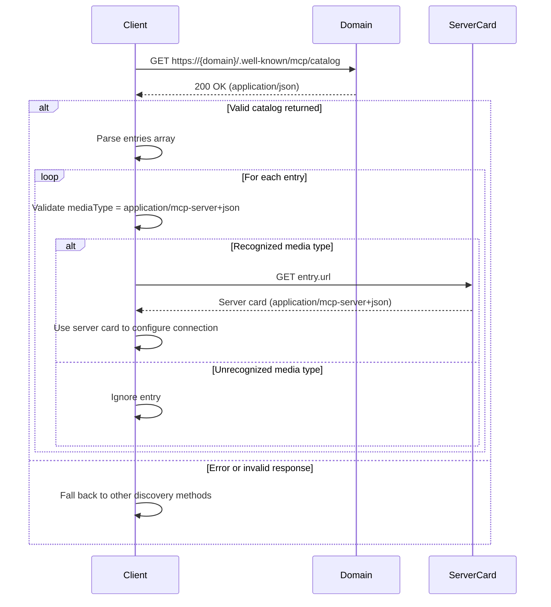

# MCP Catalog Discovery Specification

**Status:** Draft

## Overview

The MCP Catalog is a JSON document that lists MCP server cards available from a domain, enabling config-free auto-discovery. It is a minimal, MCP-scoped subset of the [AI Catalog](https://github.com/Agent-Card/ai-catalog) specification.

## Well-Known URI

```
/.well-known/mcp/catalog
```

The catalog endpoint:

- MUST be accessible via HTTPS (HTTP MAY be supported for local/development use)
- MUST return `Content-Type: application/json`
- MUST include appropriate CORS headers (see [Security Considerations](#security-considerations))
- SHOULD include appropriate caching headers (see [Security Considerations](#security-considerations))

## Catalog Format

The catalog is a JSON object with two required top-level members:

| Field         | Type   | Required | Description                                                    |
| ------------- | ------ | -------- | -------------------------------------------------------------- |
| `specVersion` | string | Yes      | Version of the MCP Catalog format. Currently `"draft"`.        |
| `entries`     | array  | Yes      | Array of [Catalog Entry](#catalog-entry) objects. MAY be empty. |

## Catalog Entry

Each entry in the `entries` array is a JSON object with exactly three required fields:

| Field        | Type   | Required | Description                                                                  |
| ------------ | ------ | -------- | ---------------------------------------------------------------------------- |
| `identifier` | string | Yes      | A URI or URN identifying this server (e.g., `urn:mcp:server:example/weather`) |
| `mediaType`  | string | Yes      | MUST be `application/mcp-server+json`                                        |
| `url`        | string | Yes      | URL where the full server card can be retrieved                               |

All metadata (name, description, capabilities, etc.) lives in the server card itself — the catalog entry intentionally carries no optional fields.

## Examples

### Single Server

```json
{
  "specVersion": "draft",
  "entries": [
    {
      "identifier": "urn:mcp:server:example.com/weather",
      "mediaType": "application/mcp-server+json",
      "url": "https://example.com/.well-known/mcp-server-card"
    }
  ]
}
```

### Multiple Servers

```json
{
  "specVersion": "draft",
  "entries": [
    {
      "identifier": "urn:mcp:server:acme.com/code-review",
      "mediaType": "application/mcp-server+json",
      "url": "https://acme.com/.well-known/mcp-server-card/code-review"
    },
    {
      "identifier": "urn:mcp:server:acme.com/docs-search",
      "mediaType": "application/mcp-server+json",
      "url": "https://acme.com/.well-known/mcp-server-card/docs-search"
    },
    {
      "identifier": "urn:mcp:server:acme.com/ci-cd",
      "mediaType": "application/mcp-server+json",
      "url": "https://acme.com/.well-known/mcp-server-card/ci-cd"
    }
  ]
}
```

## Client Discovery Flow



Clients SHOULD validate that each entry has `mediaType` set to `application/mcp-server+json` and MUST ignore entries with unrecognized media types. This ensures forward compatibility as new entry types are introduced.

## Relationship to AI Catalog

The MCP Catalog is a transitional mechanism designed to provide immediate value while the broader [AI Catalog](https://github.com/Agent-Card/ai-catalog) specification matures.

- **Structural compatibility:** MCP Catalog entries are structurally compatible with AI Catalog entries. Each entry uses the same `identifier`, `mediaType`, and `url` fields.
- **Dual serving:** Domains MAY serve both `/.well-known/mcp/catalog` and the AI Catalog well-known URI during the transition period. The same entries can be used in both documents.
- **Direct inclusion:** MCP Catalog entries can be included directly in an AI Catalog document without modification. No field mapping or transformation is required.

As the AI Catalog specification stabilizes, implementers SHOULD plan for eventual migration to the unified catalog format.

## Security Considerations

### Information Disclosure

Catalog entries MUST NOT include sensitive information. The catalog is a public discovery document — all fields are intended to be world-readable.

### CORS Requirements

The catalog endpoint MUST include the following CORS headers to enable browser-based clients:

```
Access-Control-Allow-Origin: *
Access-Control-Allow-Methods: GET
Access-Control-Allow-Headers: Content-Type
```

### Caching

The catalog endpoint SHOULD include caching headers to reduce unnecessary requests:

```
Cache-Control: public, max-age=3600
```

### Transport Security

The catalog MUST be served over HTTPS with TLS 1.2 or later in production environments. HTTP MAY be used for local development and testing only.

## References

- [SEP-2127: MCP Server Cards](https://github.com/modelcontextprotocol/modelcontextprotocol/pull/2127)
- [Server Card Working Group Discussion](https://github.com/modelcontextprotocol/modelcontextprotocol/discussions/2563)
- [AI Catalog Specification](https://github.com/Agent-Card/ai-catalog)
